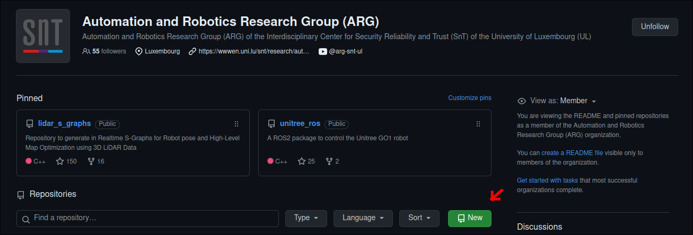
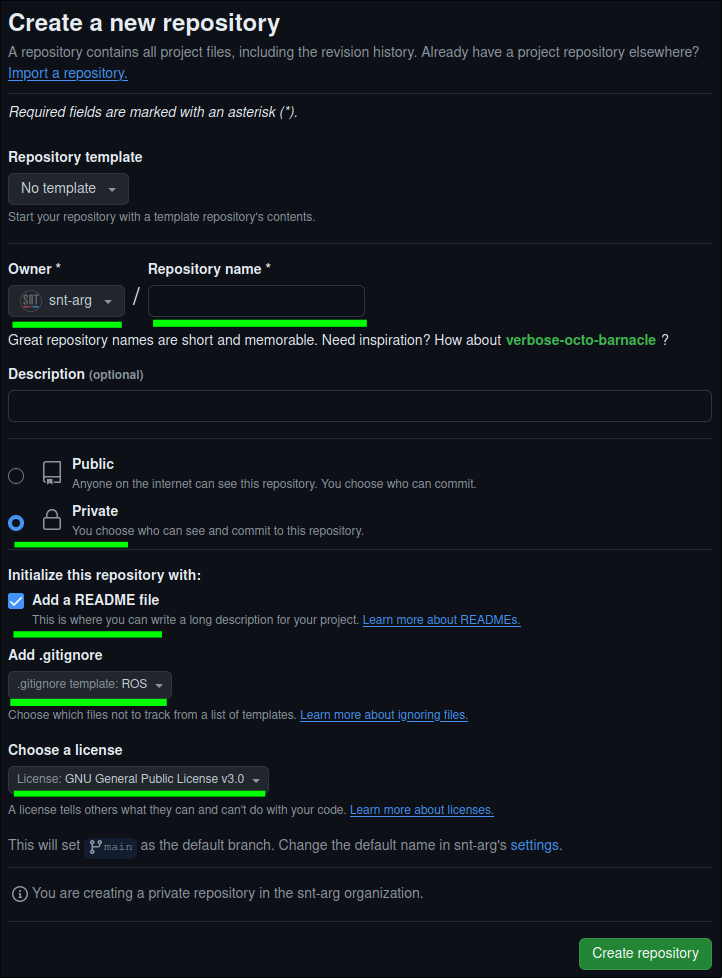

# New Project

This page aims at giving you the knowledge on how create a new repository within
the organization as well as some insights why we use GitHub teams.

## Why Teams?

In our organization, we use teams to separate our research lines, such as situational awareness or control & planning.
This not only allows us to know which repository relates to each field, but it also allows
the administrators to control who has access to what.

One of the main reasons to use teams is that since one project can have more than one
dependency, for someone to have access, we would need to individually add the person
to each repository that is needed. With teams, we only need to have access to the team
and the person would have access to all the repositories it needs.

However, this comes at one cost. New repositories that are created need to be moved
to the teams individually, otherwise, no one but the creator and the admins can see it.

## Creating a New Repository

!!! hint

    If you already know how to create a repository, jump to [here](#adding-your-new-repository-to-a-team)

In order to create a new project, you should go to the organization and press the
**new** button, as shown in the picture bellow:
{ align=center }

Then, you should name your repository as well as toggle some checkboxes as shown in the picture bellow,
highlighted in green:

!!! info

    Make sure to select `snt-arg` as the owner and not yourself!

{ align=center }

## Adding your New Repository to a Team

As said previously, each new repository needs to be added manually to a team.
However, only administrators can do this. For this reason, we use a repository
that only serves as a way of you communicating that you have created a new repository
in order for someone to add it. To do so, you can following steps:

1. Go to this [repository](https://github.com/snt-arg/Add-New-Repository/issues)
1. Create a new issue and fill in the missing information
1. All done. Someone will then make sure you repo will be added to the correct teams.
