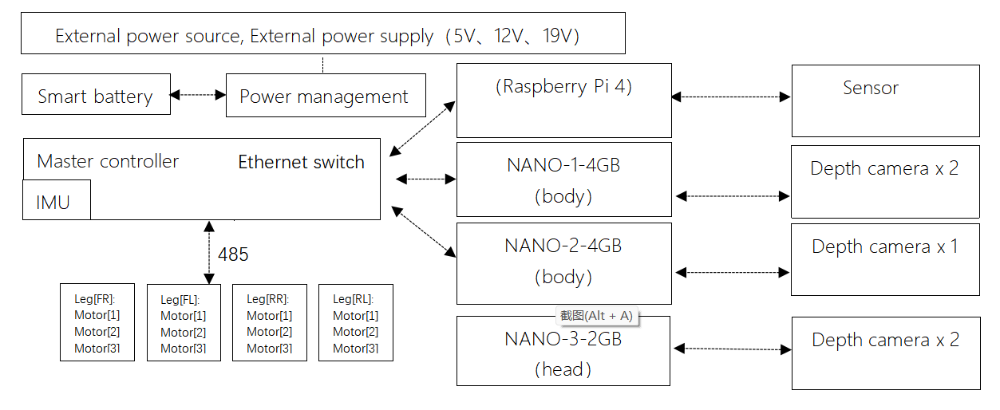

# Unitree Go1

Unitree Go1 is one of our legged robots. In this page, we provide the instructions
that one needs to know to either teleoperate as well as controlling it using ROS.

## Teleoperation with Remote

1. Place battery in robot
1. **Power on robot**: _Short press_ and then _long press_ the battery power button
1. **Power remote**: _short press_ and then _long press_ power button
1. Wait for robot to stand
1. Follow instructions on remote
1. **Sit**: 2x L2+A -> L2+B
1. **Stand**: 2x L2+A -> SELECT
1. **Power off robot**: Sit robot first and then repeat step 2.

## Control using ROS

A ROS package is available to control the robot using ROS velocity commands as well as receive data from robot. You can install it using the following command:

```sh
sudo apt install ros-<distro>-unitree-ros
```

!!! note

    Only humble and iron are supported. For the foxy devel, please consult [package repo](https://github.com/snt-arg/unitree_ros?tab=readme-ov-file#%EF%B8%8F-installation-)

<!-- TODO: Create repo and refer the url for unitree credentials -->

Then, to control the robot, first connect to it's hotspot. The `SSID` should be the one containing **GO1** on it. For the password, refer to [here](). Once connected, run the following command:

```sh
ros2 launch unitree_ros unitree_driver_launch.py wifi:=true
```

In case you are connected to the robot via cable, no need to connect to WiFi. Simply run `ros2 launch unitree_ros unitree_driver_launch.py`

!!! tip "More on the ROS package"

    In case you desire to know more about what the package offers, please refer to it's [documentation](https://github.com/snt-arg/unitree_ros).

## System Architecture

The following picture illustrates well each component available inside the robot.

{ align=center }

- Has 4 computers
- Has 5 Depth cameras

      - Front
      - Left & Right
      - Bottom front
      - Bottom back

- Has 3 ultrasonic sensors

### Computer IPs

- **Main control board**: MCU (`192.168.123.10`)
- **Motion Control Board**: Raspberry Pi 4B (`192.168.123.161`)
- **Sensing motherboard**: Nano (head, `192.168.123.13`)
- **Nano** (body, `192.168.123.14`)
- **Nano** (body, `192.168.123.15`)

## Resources

For more information on the unitree SDK, you can find the docs [here](https://unitree-docs.readthedocs.io/en/latest/get_started/Go1_Edu.html){target="\_blank"}
