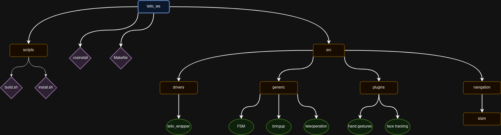

# ROS

In our team, which focuses on robotics, the use of ROS should be highly encourage,
if not mandatory. This not only will make sure that your work will be able to be
tested on real platforms, but also streamline your work due to the amount of
projects that will help evolve faster.

Follow this guide if you are going to create a ROS package. It will help you follow
the ROS standards, and maintain consistency across all our repositories.
In addition, the guide streamlines the process of publishing it to the ROS index,
as well as having a consistent pattern throughout our team.

## Version of ROS

There are 2 version available at the moment of writing this guide, ROS1 and ROS2.
If you are about to start now, please use **ROS2**, choosing the distribution that
is the **LTS** version. Currently, this is [humble](https://docs.ros.org/en/humble/index.html).

!!! note

    Please try to avoid ROS1. This is because ROS1 will reach end-of-life soon.

## Starting a Fresh Project

### Creating the Repository

!!! note

    Before starting a new project, you should get familiar with our [git conventions](./git.md).

In order to create a new project, you should go to the organization and press the
**new** button, as shown in the picture bellow:
{ align=center }

Then, you should name your repository as well as toggle some checkboxes as shown in the picture bellow,
highlighted in green:

!!! info

    Make sure to select `snt-arg` as the owner and not yourself!

{ align=center }

### Adding Third Party Packages

There are several ways one could do that. The most common and the suggested way,
is to make use of the tool [vcstool](http://wiki.ros.org/vcstool). You should create a
file `.rosinstall`. This file should look something like this:

```
repositories: # The file needs to start with this line!
  s_graphs_utils/fast_gicp: # Path to where the package should be located
    type: git # This most likely should not change
    url: https://github.com/SMRT-AIST/fast_gicp.git # The package git https
    version: master # Branch name of the package repository
  # Another package...
```

For an example file, you can refer to [unitree_ws](https://github.com/snt-arg/unitree_ws/blob/main/.rosinstall).

### Creating a Package Within Your Package

In case you will create more that one package, say a message package for you package,
there are 2 possible ways.

The first one is to have them both on the repo. The structure should be like this:

```
package_name_root
    - package_name
    - package_name_msgs
    - another package
    - README.md
    - .rosinstall
    - .gitignore
    - ...
```

The second option is to create a separate repository and then including it in the
`.rosinstall`.

!!! note

    You should avoid adding them as submodules. This will complicate things in
    case you desire to push your package to ROS index.

## Workspaces

Workspaces are needed when you plan on using your package in a real or virtual platform.
This means that you package will no longer be a standalone package, but will work with
other packages. For instance, you will need a driver for the robot or for a lidar.

That's when a workspace will come in handy.

To create a workspace, proceed to create a new repo, where the name should be of the
form `<project_name>_ws`. This repo should not directly include any package. Instead,
it should include scripts to setup the workspace, by getting the necessary packages,
having docker files to build docker images etc. This means that you should still use
[vcstool](http://wiki.ros.org/vcstool) for managing workspace repositories.

Below are some files you might consider having. For a full fledged workspace, consider
having a look at [tello_ws](https://github.com/snt-arg/tello_ws) or [unitree_ws](https://github.com/snt-arg/unitree_ws).

```
    |- .gitignore
    |- .rosinstall
    |- requirements.txt
    |- Dockerfile
    |- README.md
    |- setup.sh
```

The `.rosinstall`file points to one or more ROS package repositories that are
required by the project, and is used by `vcstool` to fetch these dependencies.

Similarly, the `requirements.txt` file should contain a list of required Python
modules, whereas the `Dockerfile` specifies how to build a Docker container for the project.

Finally, `setup.sh` is a script that calls automates the setup of the workspace
e.g., calling `vcstool`, `pip`, and so on.

!!! note

    Note that except for the `.rosinstall`, all other files are optional.

- #### Example Workspace Structure

  

!!! warning

    Other directories can be added depending on the requirements of each project, but try to keep the folder structure as compact as possible.

Below is a description of what should be inside each of these directories.

- `/drivers` : This folder contains all packages providing drivers for running both simulations and the real robot. The `/drivers` directory can have sub-folders such as `/real` and `/simulation`, containing packages for executing the real world robot and the robot in simulation, respectively.

- `/generic` : This folder contains all relevant packages for launching the processes required for successully executing a given task/mission for the project. It can be further divided into `/bringup` and `/description`. As an example, the `5G_sky_ws` workspace could have both the `5G_sky_bringup` and `5G_sky_description` subdirectories.

- `/navigation` : This folder contains all packages required for navigation. It can be divided into sub-folders such as `/slam`, `/localization`, `/planning` and `/perception`.

- `/utils` : This folder contains all packages that are required but not available in the form of binaries.

- #### Create Project Bringup & Project Description:

  Each project will have a bringup repository and a description repository, these repos will be named as project_bringup and project_description.

  - **project_bringup** : The project_bringup as the name suggests is responsible for bringing up all the processes responsible for proper execution of the robot and its sensors, where it be in a simulated environment or in real world. Basically it has all the launch and config files of the different packages which are grouped together to launch an entire mission of the robot. How to create a bringup repo (example: `5G_sky_bringup`):

    ```
    cd ~/workspace/ros/5G_sky_ws/src/generic && catkin_create_pkg 5G_sky_bringup roscpp rospy
    cd 5G_sky_bringup && mkdir launch && mkdir config
    ```

    The above command creates a ros repo, it also adds `launch` and `config` folders. You have to push this created ros repo to github.

  - **project_description** : As the name suggests the project description contains the description files the projects. The description file contains the urdfs, meshes, worlds etc for the robots and the environment of the robot.

    ```
    cd ~/workspace/ros/5G_sky_ws/src/generic && catkin_create_pkg 5G_sky_description
    cd 5G_sky_description && mkdir launch && mkdir config && mkdir urdf && mkdir worlds
    ```

    The above command will create a ros repo which will have `launch`, `config`, `urdf` and `worlds` folders.

- #### Clone All Remaining Required Repos:

  You should also clone all the relevant ros packages that do not have binaries and need to installed in the project_ws in the relevant folders. For example if we need a ros package of `hdl_graph_slam` inside our `5G_sky_ws` you can clone it inside the folder navigation/SLAM

- #### Upload Workspace Management File:

  Once you have all the repos cloned just perform the command below to create a `.rosinstall` file which will contain the entire repository management.

  ```
  cd ~/workspace/ros/5G_sky_ws && touch .rosinstall
  vcs export src > .rosinstall
  git add .rosinstall && git commit -m 'added .rosinstall'
  git push
  ```

## Releasing Package to ROS Index

TODO
